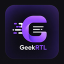

<div align="center">
  
  <h1>GeekRTL</h1>
  <p>RTL fix for Persian & Arabic text on AI chat platforms</p>
  <p>تصحیح نمایش متن فارسی و عربی در پلتفرم‌های هوش مصنوعی</p>
  <br/>
  
  
  
</div>

---

## English

### The Problem
When chatting in Persian or Arabic on AI platforms like Claude, ChatGPT, or DeepSeek, responses are displayed LTR (left-to-right) — making text hard to read. Mixed Persian/English content gets jumbled with no clear direction.

### The Solution
GeekRTL automatically detects Persian/Arabic text in AI responses and applies proper RTL direction and typography, so everything reads naturally.

### ✅ Supported Platforms

| Platform | URL |
|----------|-----|
| Claude | claude.ai |
| ChatGPT | chatgpt.com |
| DeepSeek | chat.deepseek.com |
| Gemini | gemini.google.com |
| Microsoft Copilot | copilot.microsoft.com |
| Grok | grok.com |

### 🚀 Installation

1. Clone this repo:
   ```bash
   git clone https://github.com/mani-imani/GeekRTL.git
   ```
2. Open Chrome → `chrome://extensions/`
3. Enable **Developer mode** (top right)
4. Click **Load unpacked** → select the `GeekRTL` folder
5. Open any AI platform and chat in Persian 🎉

### ⚙️ How It Works

- Scans AI message elements on page load
- Watches for new messages via `MutationObserver` (works with streaming)
- Calculates RTL character ratio per message block
- Applies `dir="rtl"` for mostly-Persian/Arabic content
- Applies `dir="auto"` for mixed content
- Code blocks always stay LTR ✓

### 🔧 Adding a New Site

Edit `sites/sites.json`:
```json
{
  "name": "YourAI",
  "host": "yourai.com",
  "selectors": [".message-content"]
}
```
Then add the URL to `manifest.json` under `matches`.

---

## فارسی

### مشکل
وقتی توی پلتفرم‌های هوش مصنوعی مثل Claude، ChatGPT یا DeepSeek به فارسی چت می‌کنیم، پاسخ‌ها به صورت چپ‌چین (LTR) نمایش داده می‌شن و خوندنشون سخته. متن‌های مخلوط فارسی و انگلیسی هم به هم می‌ریزن.

### راه‌حل
GeekRTL به صورت خودکار متن فارسی و عربی رو توی پاسخ‌های AI تشخیص میده و جهت RTL و تایپوگرافی مناسب رو اعمال می‌کنه.

### ✅ پلتفرم‌های پشتیبانی‌شده

| پلتفرم | آدرس |
|--------|------|
| Claude | claude.ai |
| ChatGPT | chatgpt.com |
| DeepSeek | chat.deepseek.com |
| Gemini | gemini.google.com |
| Microsoft Copilot | copilot.microsoft.com |
| Grok | grok.com |

### 🚀 نصب

1. ریپو رو کلون کن:
   ```bash
   git clone https://github.com/mani-imani/GeekRTL.git
   ```
2. Chrome رو باز کن و برو به `chrome://extensions/`
3. **Developer mode** رو از گوشه بالا راست فعال کن
4. روی **Load unpacked** کلیک کن و پوشه `GeekRTL` رو انتخاب کن
5. یه سایت AI باز کن و به فارسی بنویس 🎉

### ⚙️ نحوه کار

- هنگام لود صفحه، المان‌های پیام رو اسکن می‌کنه
- با `MutationObserver` منتظر پیام‌های جدید می‌مونه (streaming هم پوشش داده میشه)
- نسبت کاراکترهای RTL رو در هر بلوک پیام محاسبه می‌کنه
- اگه بیشتر از ۳۰٪ فارسی/عربی بود → `dir="rtl"` اعمال میشه
- اگه مخلوط بود → `dir="auto"` اعمال میشه
- بلوک‌های کد همیشه LTR می‌مونن ✓

### 🔧 اضافه کردن سایت جدید

فایل `sites/sites.json` رو ویرایش کن:
```json
{
  "name": "YourAI",
  "host": "yourai.com",
  "selectors": [".message-content"]
}
```
بعد آدرس سایت رو توی `manifest.json` زیر `matches` اضافه کن.

---

### 📁 ساختار پروژه

```
GeekRTL/
├── manifest.json          ← تنظیمات اکستنشن (Manifest V3)
├── content/
│   ├── rtl-fixer.js       ← منطق اصلی تشخیص و تصحیح RTL
│   └── styles.css         ← استایل‌های RTL + فونت
├── sites/
│   └── sites.json         ← سلکتورهای هر سایت (قابل توسعه)
├── popup/
│   ├── popup.html         ← UI افزونه
│   └── popup.js           ← منطق toggle
└── icons/                 ← آیکون‌های افزونه
```

---

<div align="center">
  Made with ❤️ by <a href="https://github.com/mani-imani">GeekMani</a>
</div>
